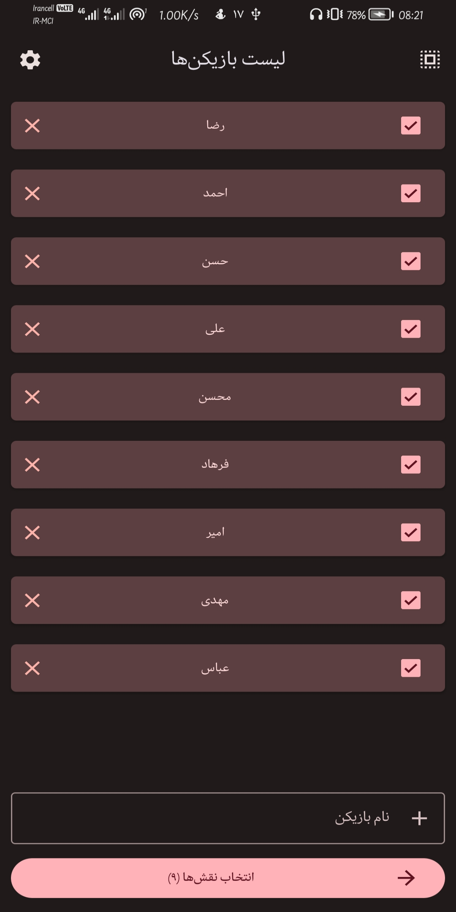
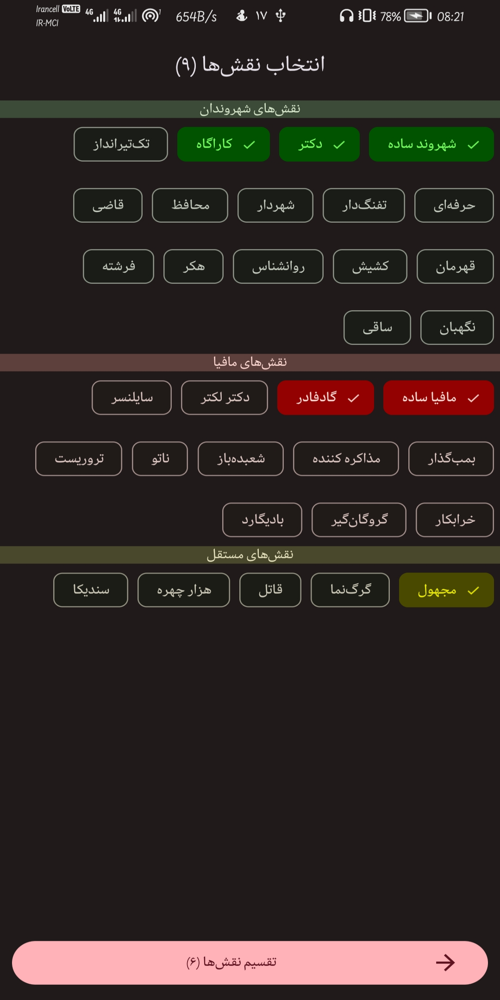
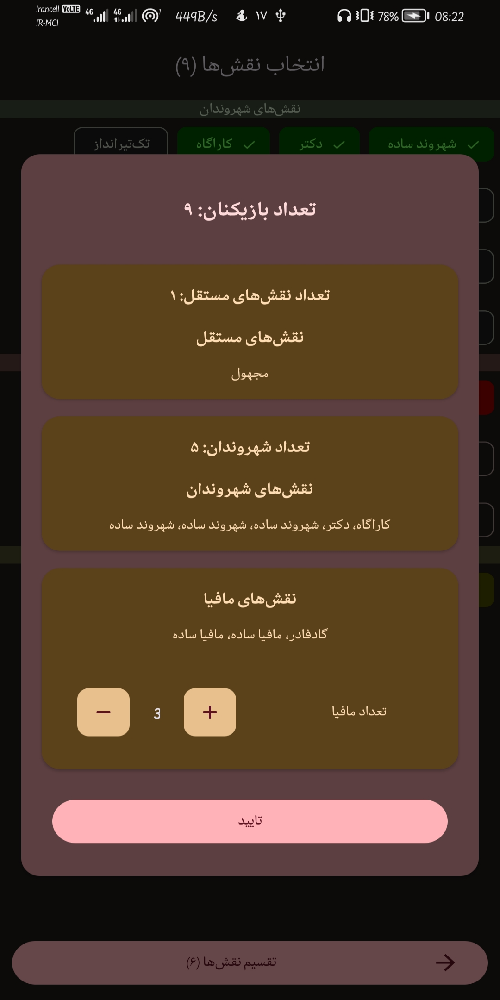
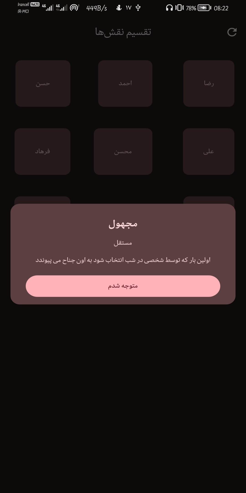

<!-- markdownlint-disable MD033 MD041 -->
 

  

  <h3 align="center">Mafia Party Game</h3>

  

    A Mafia party game app for Android using Clean Architecture, MVVM, Kotlin and View Binding Build with ❤️
     
     
    <a href="./docs/mafia-en.md"><strong>Explore the docs »</strong></a>
     
     
    <a href="https://github.com/IamRezaMousavi/Mafia/issues">Report Bug</a>
    .
    <a href="https://github.com/IamRezaMousavi/Mafia/issues">Request Feature</a>
  

<!-- markdownlint-enable MD041 -->

   

## Table Of Contents

* [About the Project](#about-the-project)
* [Supported Language](#supported-languages)
* [Roadmap](#roadmap)
* [Contributing](#contributing)
* [License](#license)
* [Authors](#authors)

## About The Project

The Main Page | The Role Page | The Player Roles Dialog | The Role Dialog
--- | --- | --- | ---
 |  |  | 

See full documentation: [English](./docs/mafia-en.md), [فارسی](./docs/mafia-fa.md)

**[Mafia](https://en.wikipedia.org/wiki/Mafia_(party_game))**, also known as **Werewolf**, is a Russian [social deduction game](https://en.wikipedia.org/wiki/Social_deduction_game) created by Dimitry Davidoff in 1986. The game models a conflict between two groups: an informed minority (the mafiosi or the werewolves) and an [uninformed](https://en.wikipedia.org/wiki/Information_asymmetry) majority (the villagers). At the start of the game, each player is secretly assigned a role affiliated with one of these teams. The game has two alternating phases: first, a night-phase, during which those with night-killing-powers may covertly kill other players, and second, a day-phase, in which all surviving players debate and vote to eliminate a suspect. The game continues until a faction achieves its [win-condition](https://en.wikipedia.org/wiki/Win_condition); for the village, this usually means eliminating the evil minority, while for the minority, this usually means reaching numerical parity with the village and eliminating any rival evil groups.

## Supported Languages

* English
* Persian

The app automatically launches in Persian, but you can change the language anytime in the settings.

## Roadmap

See the [open issues](https://github.com/IamRezaMousavi/Mafia/issues) for a list of proposed features (and known issues).

## Contributing

Contributions are what make the open source community such an amazing place to be learn, inspire, and create. Any contributions you make are **greatly appreciated**.

* If you have suggestions for adding or removing projects, feel free to [open an issue](https://github.com/IamRezaMousavi/Mafia/issues/new) to discuss it, or directly create a pull request after you edit the *README.md* file with necessary changes.
* Please make sure you check your spelling and grammar.
* Create individual PR for each suggestion.
* Please also read through the [Code Of Conduct](https://github.com/IamRezaMousavi/Mafia/blob/main/CODE_OF_CONDUCT.md) before posting your first idea as well.

### Creating A Pull Request

1. Fork the Project
2. Create your Feature Branch (`git checkout -b feature/AmazingFeature`)
3. Commit your Changes (`git commit -m 'Add some AmazingFeature'`)
4. Push to the Branch (`git push origin feature/AmazingFeature`)
5. Open a Pull Request

## License

Distributed under the GPL-3.0 License. See [LICENSE](https://github.com/IamRezaMousavi/Mafia/blob/master/LICENSE) for more information.

## Authors

* **Reza Mousavi** - *Comp Eng Student* - [Reza Mousavi](https://github.com/IamRezaMousavi/) - *Maintainer*

---
