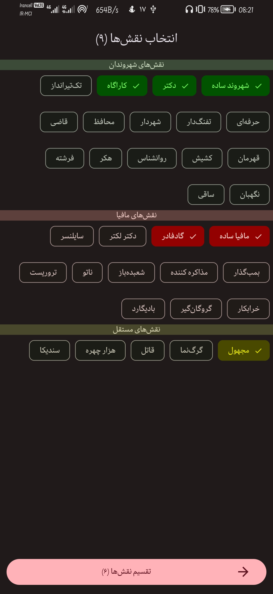

# Mafia

A Mafia party game app for Android using Clean Architecture, MVVM, Kotlin and Data Binding Build with ❤️

## Mafia (party game)

See full documentation: [English](./docs/mafia-en.md), [فارسی](./docs/mafia-fa.md)

**[Mafia](https://en.wikipedia.org/wiki/Mafia_(party_game))**, also known as **Werewolf**, is a Russian [social deduction game](https://en.wikipedia.org/wiki/Social_deduction_game) created by Dimitry Davidoff in 1986. The game models a conflict between two groups: an informed minority (the mafiosi or the werewolves) and an [uninformed](https://en.wikipedia.org/wiki/Information_asymmetry) majority (the villagers). At the start of the game, each player is secretly assigned a role affiliated with one of these teams. The game has two alternating phases: first, a night-phase, during which those with night-killing-powers may covertly kill other players, and second, a day-phase, in which all surviving players debate and vote to eliminate a suspect. The game continues until a faction achieves its [win-condition](https://en.wikipedia.org/wiki/Win_condition); for the village, this usually means eliminating the evil minority, while for the minority, this usually means reaching numerical parity with the village and eliminating any rival evil groups.

---

## Screenshot

The Main Page | The Role Page | The Player Roles Page | The Role Dialog
--- | --- | --- | ---
 |  |  | 
